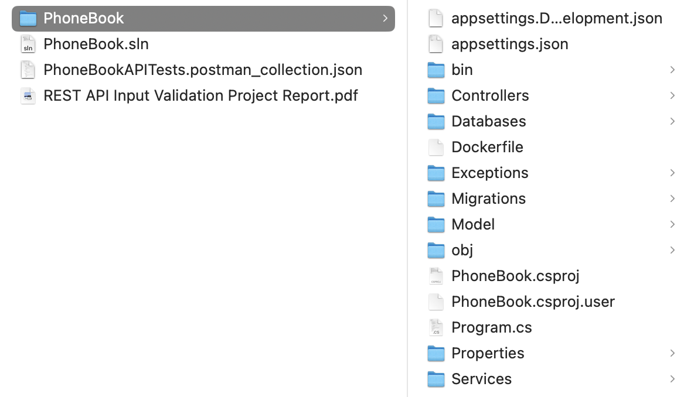
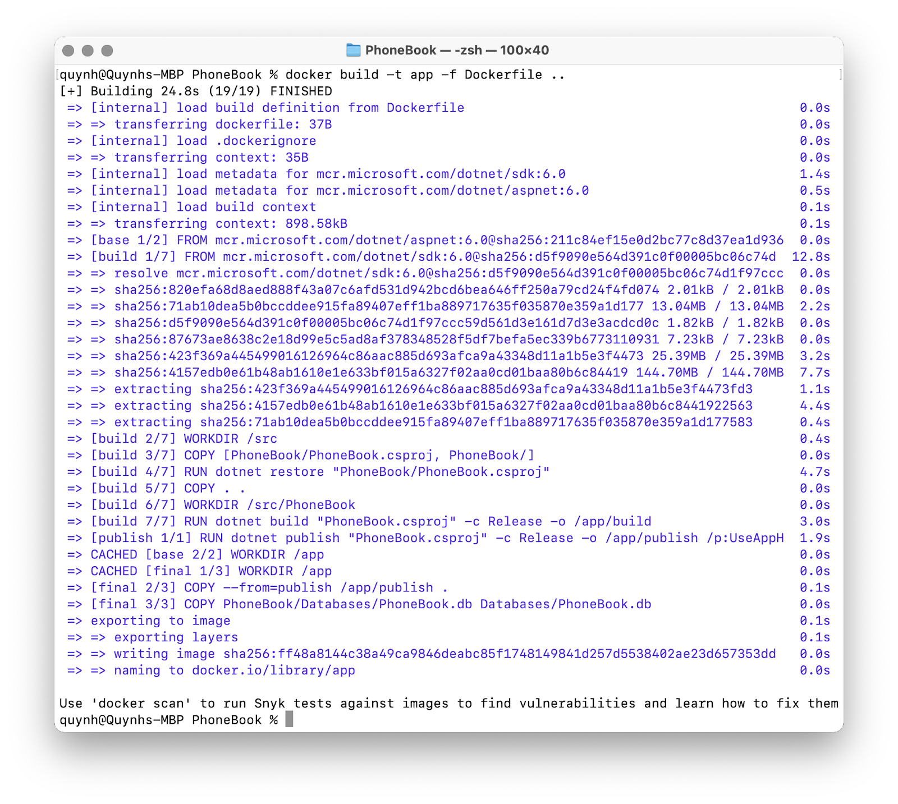
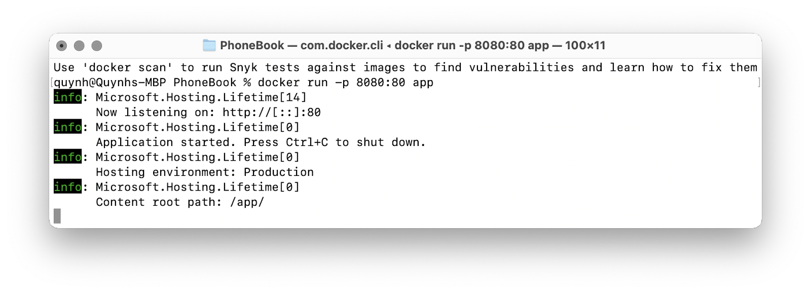

# 1. Installation
### 1.1 Build

Clone the PhoneBook repository or download the project folder.

From the directory that the repository is in, execute:

```
cd PhoneBook/PhoneBook
```



Inside a terminal at the current directory, build the Docker image with the command:

```
docker build -t app -f Dockerfile ..
```

The corresponding output should look similar to:



### 1.2 Run

To run the web server in the container and be able to access it on your host machine, you need to map port 80 from the container to an available port on your host machine.

To do so, execute the following command:

```
docker run -p 8080:80 app
```

The corresponding output should look like this:



You should now be able to access the API endpoints at `localhost:8080/PhoneBook/{API_ENDPOINT}`. 

For example, to list the phone book entries, visit `localhost:8080/PhoneBook/list`.


# 2. Architecture 
### 2.1 Overall Architecture

The REST API follows a basic model-view-controller (MVC) pattern but without the view as this backend only serves data in the form of JSON objects, not HTML content. 

When HTTP requests are sent to the port (80 on the container), the router maps each endpoint to a corresponding “action function.” 
These “action functions” are defined by the controller, or specifically, the `PhoneBookController`, and they determine how the server should respond to the request.

### 2.2 Dependencies

The `PhoneBookController` has 2 dependencies, an `IPhoneBookService` and `ILogger`. 

At build time, the ASP.NET Core builder injects the 2 dependencies into the controller. 
Specifically, for this application, the `DatabasePhoneBookService` is injected as the `IPhoneBookService`, and `ILogger` is automatically injected by ASP.NET Core.

### 2.3 DatabasePhoneBookService

The `DatabasePhoneBookService` provides the business logic of the application. 

This service does so via a dependency injection of a `DbContext`, which does the actual communication with the database via defined API calls, abstracting away the SQL statements from developers. 

Because the `DatabasePhoneBookService` is dependent on a `DbContext`, a scoped object provided by the Entity Framework Core framework, the service itself must also be scoped. 

The `DatabasePhoneBookService` is also dependent on an `ILogger`, which again, is automatically injected by ASP.NET Core.

### 2.4 Logger

The specific logger used in this REST API is the `Serilog` logger. 

This logger is injected as an `ILogger` object into the `PhoneBookController` and `DatabasePhoneBookService` to audit any API calls, such as listing the phone book contents, adding a new entry, 
and removing entries. The logger logs the timestamp, log level, log source, message, and exception associated with the log (if any).

### 2.5 Models

`PhoneBookEntry`: This is the actual object that users are exposed to via the API. 
It contains 2 fields, a name and number, both of which are strings. 
It is in this object where the input validation is applied via regular expression attributes. 
The regular expressions are matched and enforced automatically by ASP.NET Core’s “ModelState” check, which asserts that the data matches the model schema.

`PhoneBookEntryDB`: This model is what gets actually stored in the database. 
It has the same fields as the `PhoneBookEntry` object with an additional GUID field to serve as the primary key. Users are not exposed to this model.

### 2.6 Persistent Storage

For persistent storage, an SQLite database is used.

# 3  Assumptions
### 3.1 Name Assumptions

The follow assumptions are made regarding the name input field:
- There cannot be duplicate names. Any attempt to add an entry with an existing name in the database will result in overwrite of the corresponding phone number.
- Users can have at most one middle name, if they choose to add it.
- Names are case sensitive. `Bob` and `bob` are considered different users.
- There can be at most one apostrophe in the name, and it can only appear after a single letter.

### 3.2 Phone Number Assumptions
- There cannot be duplicate phone numbers. Any attempt to add an entry with an existing number in the database will result in overwrite of the corresponding name.
- The country code can be space-separated from the start of the phone number by 1 space.
  - e.g. `+1 (123) 456-7890` and `+1 (123) 456-7890` are both valid
- For Dutch phone numbers, the country code can also be period-separated from the start of the phone number by one period.
  - e.g. `45 12 34 56 78` and `45.12.34.56.78` are both valid
- If the first 3 digits of a U.S. phone number are surrounded by parenthesis, there must not be a space after the close parenthesis.
  - e.g. `(123) 456-7890` is not valid, but `(123) 456-7890` is valid
- Country codes are at most 3 digits long.
- Letters are not valid characters.
  - e.g. There should be no “ext” text in the phone number input string

